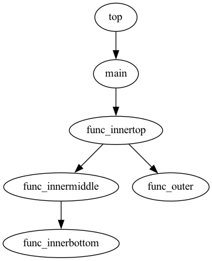

# canalysis
Cソースコードを解析するためのツール

# ツール一覧
| ツール名        | 機能                                   | 
| ------------- | ------------------------------------- |
| extcallrel.sh | Cソースコード内の関数の呼び出し関係を画像化する  |
| cohesion.sh   | Cソースコードの凝集度を計算する              |

# デモ
## extcallrel
sample/sample.c の呼び出し関係



# 事前準備
## 実行環境
### 想定
- Bourne Shell

### 動作確認済
- MacBook Air M2
- macOS Monterey 12.6.1
- ターミナル 2.12.7
- GNU bash 3.2.57

## 必要パッケージ
| パッケージ名       | バージョン（動作確認済）   |
| --------------- | ------------------- |
| GNU cflow       | 1.7                 |
| Graphviz        | 7.0.1               |
| Universal Ctags | 5.9.0               |

# 使用例
ソースコード input.c の呼び出し関係を output.png に出力する
```bash
$ ./extcallrel.sh -ooutput.png input.c
```

ソースコード input.c の凝集度を計算する
```bash
$ ./cohesion.sh input.c
```
